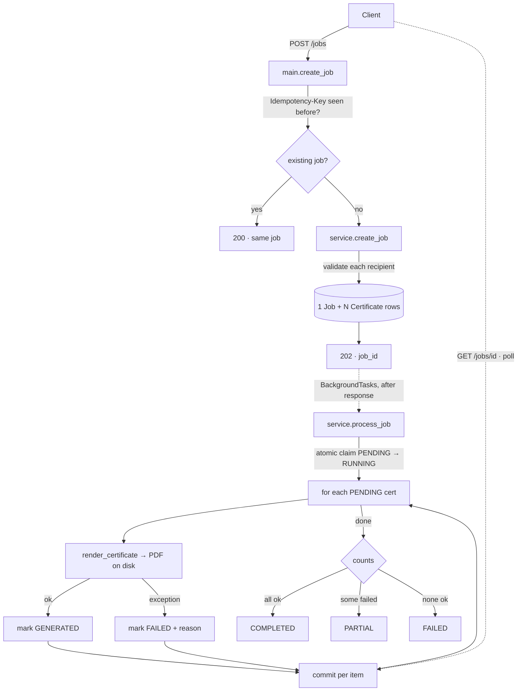
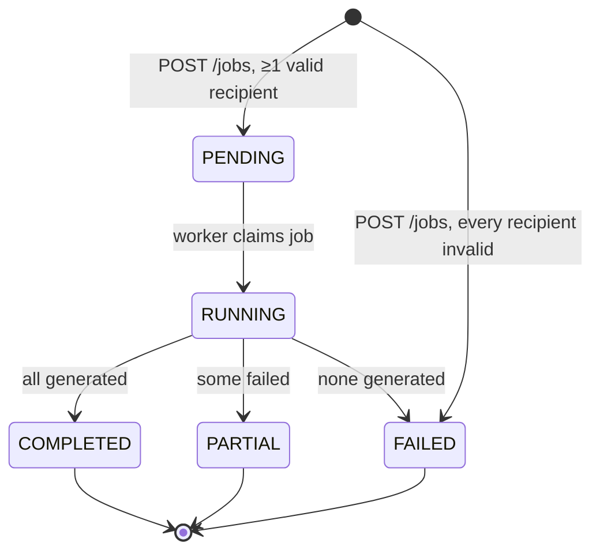

# Bulk Certificate Generator API

[](https://github.com/ArunkumarBaddepalli/bulk-certificate-generator-api/actions/workflows/ci.yml)

Submit a list of recipients once. The API validates each one, generates a PDF certificate per valid recipient in the background, and lets you poll progress and download the results — individually or as a single ZIP.

**Stack:** Python · FastAPI · SQLAlchemy (SQLite by default, Postgres-ready) · ReportLab · pytest · Docker

**Features**
- One request → many certificates. Up to 1000 recipients per job.
- Per-recipient validation: a bad row is recorded as `FAILED` with the reason; the rest proceed.
- Per-recipient failure isolation at generation time: one crash never stops the batch.
- Live progress: `GET /jobs/{id}` shows `succeeded` / `failed` counts while the job runs.
- Filter results by status, paginate, download any generated PDF, or the whole job as a ZIP.
- `Idempotency-Key` header: a retried request returns the original job instead of generating everything twice.
- Swagger UI at `/docs`.

---

## Quick start

**Option A — local Python**

```bash
git clone https://github.com/ArunkumarBaddepalli/bulk-certificate-generator-api.git
cd bulk-certificate-generator-api

python -m venv .venv
source .venv/bin/activate          # Windows: .venv\Scripts\activate
make install                       # = pip install -r requirements.txt
make run                           # = uvicorn app.main:app --reload
```

**Option B — Docker**

```bash
docker compose up --build
```

Either way, open http://127.0.0.1:8000/docs. The SQLite file and `storage/` folder are created on first run (inside a named volume for Docker).

`make test` runs the suite, `make lint` runs ruff.

Optional environment variables (see `.env.example`):

| Variable | Default | Purpose |
|---|---|---|
| `DATABASE_URL` | `sqlite:///./certificates.db` | Any SQLAlchemy URL, e.g. `postgresql+psycopg://…` |
| `CERT_STORAGE_DIR` | `./storage/certificates` | Where PDFs are written |
| `MAX_RECIPIENTS_PER_JOB` | `1000` | Hard cap per request |

## Run tests

```bash
pytest
```

47 tests, in-memory SQLite, temp folder for PDFs. Nothing touches your real database or disk. The same suite runs in CI on Python 3.12 and 3.13.

---

## Submit a certificate generation request

```bash
curl -s -X POST http://127.0.0.1:8000/jobs \
  -H "Content-Type: application/json" \
  -d @examples/request.json
```

`examples/request.json` has 3 valid recipients and 3 deliberately bad ones (blank name, bad email, duplicate email), so you can see both paths at once.

**Request body**

```json
{
  "event_name": "Python Backend Bootcamp 2026",
  "issuer": "Aereo Academy",
  "issue_date": "2026-10-07",
  "recipients": [
    { "name": "Arun Kumar",   "email": "arun@example.com" },
    { "name": "Priya Sharma", "email": "priya@example.com", "completion_date": "2026-10-01" }
  ]
}
```

`completion_date` is optional per recipient and defaults to `issue_date`.

**Response — `202 Accepted`**

```json
{
  "job_id": "89d227b78c8346e08b643f68f11d6914",
  "status": "PENDING",
  "total": 6,
  "accepted": 3,
  "rejected": 3,
  "status_url": "/jobs/89d227b78c8346e08b643f68f11d6914"
}
```

`accepted` = passed validation and queued. `rejected` = failed validation and recorded as `FAILED` with a reason. The response returns immediately; generation happens in the background.

**Safe retries with `Idempotency-Key`**

```bash
curl -s -X POST http://127.0.0.1:8000/jobs \
  -H "Content-Type: application/json" \
  -H "Idempotency-Key: event-42-batch-1" \
  -d @examples/request.json
```

Send the same key again — because of a timeout, a retry loop, a double-click — and you get the **same job back with `200`** instead of a second job and a second set of PDFs. The key is optional; without it every request creates a new job.

## Check progress

```bash
curl -s http://127.0.0.1:8000/jobs/{job_id}
```

```json
{
  "id": "89d227b78c8346e08b643f68f11d6914",
  "event_name": "Python Backend Bootcamp 2026",
  "issuer": "Aereo Academy",
  "issue_date": "2026-10-07",
  "status": "PARTIAL",
  "progress": { "total": 6, "processed": 6, "succeeded": 3, "failed": 3 },
  "created_at": "2026-10-09T10:15:02.114Z",
  "updated_at": "2026-10-09T10:15:02.391Z",
  "certificates_url": "/jobs/89d227b78c8346e08b643f68f11d6914/certificates"
}
```

**Job status values**

| Status | Meaning |
|---|---|
| `PENDING` | Created, worker not started yet |
| `RUNNING` | Generating; `progress` updates per certificate |
| `COMPLETED` | Every recipient generated |
| `PARTIAL` | Some generated, some failed — check `?status=FAILED` |
| `FAILED` | Nothing generated |

## Retrieve generated certificates

**List per-recipient results** (filter and paginate):

```bash
curl -s "http://127.0.0.1:8000/jobs/{job_id}/certificates?status=FAILED"
```

```json
{
  "job_id": "89d2…",
  "total": 3, "limit": 100, "offset": 0,
  "items": [
    {
      "id": "c1…", "recipient_name": null, "recipient_email": "blank-name@example.com",
      "status": "FAILED",
      "error_message": "validation: name: String should have at least 1 character",
      "download_url": null
    },
    {
      "id": "c2…", "recipient_name": "Bad Email", "recipient_email": "not-an-email",
      "status": "FAILED",
      "error_message": "validation: email: value is not a valid email address: An email address must have an @-sign.",
      "download_url": null
    },
    {
      "id": "c3…", "recipient_name": "Arun Again", "recipient_email": "ARUN@example.com",
      "status": "FAILED",
      "error_message": "validation: duplicate email in request: ARUN@example.com",
      "download_url": null
    }
  ]
}
```

Query parameters: `status` (`PENDING` | `GENERATED` | `FAILED`), `limit` (1–1000, default 100), `offset`.

**Download one PDF:**

```bash
curl -s -o certificate.pdf http://127.0.0.1:8000/certificates/{certificate_id}/download
```

Returns `application/pdf` with a `Content-Disposition: attachment` header. `404` if the id is unknown; `409` with the error message if that certificate is `FAILED`.

**Download the whole job as a ZIP:**

```bash
curl -s -o certificates.zip http://127.0.0.1:8000/jobs/{job_id}/download
```

One entry per `GENERATED` certificate, named `{recipient}_{certificate_id}.pdf`. Failed recipients are simply absent — check `?status=FAILED` for those. `409` while the job is still running; `404` if nothing was generated.

---

## Architecture

```
app/
  main.py        FastAPI routes only — thin, delegates to service
  service.py     create_job()   per-recipient validation, writes rows
                 process_job()  background worker, per-item try/except
  generator.py   render_certificate()  ReportLab template, pure function
  models.py      Job, Certificate (SQLAlchemy)
  schemas.py     Pydantic request/response models
  db.py          engine, session factory
  config.py      environment variables
tests/           one file per required test area
```

**Request flow**



**Job lifecycle**



---

## Design decisions

### FastAPI over Django / Flask
Pydantic validation is built in, OpenAPI docs are automatic, and `BackgroundTasks` is native. Django + DRF would add an ORM/migrations layer that a two-table service doesn't need.

### Background processing with `BackgroundTasks` — not synchronous, not Celery
The spec asks for the choice to be documented.

- **Synchronous** would block the client for the entire batch. At 1000 recipients that's a request lasting tens of seconds. Rejected.
- **Celery / RQ** is the right answer at real scale, but it adds a broker (Redis/RabbitMQ) and a separate worker process to install, run, and explain. For this assignment that's infrastructure without benefit.
- **`BackgroundTasks`** runs the generation in the same process, immediately after the response is sent. The client gets `202` + a job id instantly and polls. No extra services. It is a true asynchronous experience from the client's side.

The trade-off: one process, no retry on crash, and a job in `RUNNING` is lost if the server restarts mid-batch. See *Scaling* below for the upgrade path.

### Two-tier validation
Envelope problems (missing event name, empty list, bad date) return `422` — the request is malformed.

Per-recipient problems do **not** reject the request. Each recipient is validated individually; a bad one is stored as `FAILED` with the reason, and the valid ones proceed. A client sending 500 recipients with 3 bad emails gets 497 certificates and a precise list of the 3 problems, rather than a `422` and a full resubmission. This matches the "bulk" intent.

Per-recipient rules: name non-blank (≤120 chars), valid email, `completion_date` a valid date if given, and **no duplicate email within the same request** (case-insensitive — same event, same person is a data error worth surfacing rather than silently dropping).

If *every* recipient fails validation, the job is marked `FAILED` immediately and the worker is not scheduled.

### Failure isolation
`process_job` wraps each recipient's generation in its own `try/except`. One renderer crash records one `FAILED` certificate with the exception message and moves on. The job ends `PARTIAL`, and `GET /jobs/{id}/certificates?status=FAILED` lists exactly what went wrong. `tests/test_single_failure.py` proves this by patching the renderer to throw for one specific name.

Progress is committed per item, so polling shows live counts on long batches. The cost is more DB round-trips; batching every N items would be the tuning knob if that ever mattered.

### SQLite by default, Postgres by env var
SQLite means a reviewer can run this with zero setup. The same code runs on Postgres by changing `DATABASE_URL`. The only SQLite-specific code is in `db.py`: the `check_same_thread` flag, and `StaticPool` for the in-memory database the tests use.

### ReportLab for PDFs
Pure Python. No system binaries (WeasyPrint needs cairo/pango; wkhtmltopdf is a separate install). `pip install` is the whole setup.

### Storage on local disk
`storage/certificates/{job_id}/{certificate_id}.pdf`. Paths are server-generated from UUIDs, never from client input, so there is no path-traversal surface. Moving to S3 is a change to `generator.py` and the download routes only.

### Idempotency-Key
A bulk job is exactly the kind of request a client retries after a timeout, and a naive retry would generate every certificate twice. The optional `Idempotency-Key` header makes `POST /jobs` safe to repeat: the key is stored on the job with a **UNIQUE constraint**, so even two concurrent requests with the same key cannot both create a job — the database arbitrates, the loser catches `IntegrityError`, rolls back, and returns the winner's job. A replay returns the job's *current* state, not a cached copy of the original response.

Known gap, deliberately left: the same key with a *different* body returns the original job rather than `409`. The fix is to hash the body and store it alongside the key.

### Atomic job claim in the worker
`process_job` starts with `UPDATE jobs SET status='RUNNING' WHERE id=? AND status='PENDING'` and checks the row count. Only one caller can win that update, so the same job can never be processed twice even if it gets queued twice. This is cheap insurance that also makes a future "re-queue stuck jobs on startup" sweep trivial to add.

### ZIP built in memory
`GET /jobs/{id}/download` assembles the ZIP in a `BytesIO`. At the 1000-recipient cap and ~2 KB per PDF that is ~2 MB per request — fine. If certificates grew to include images, streaming the ZIP to a temp file would be the change.

---

## Scaling — honest limits and what fixes them

| Limit today | Why | Upgrade |
|---|---|---|
| Single process | `BackgroundTasks` runs in the web worker | Celery/RQ + Redis: jobs survive restarts, run on N workers |
| Job lost if server restarts mid-batch | No persistent queue | Same as above; or a startup sweep that resets `RUNNING` → `PENDING` and re-queues |
| SQLite write lock | SQLite serialises writes | Postgres |
| Local disk | Not shared across instances | S3 / object storage |

**Why parallel rendering (a thread pool) was deliberately not added:** SQLite serialises writes, so a thread pool rendering PDFs concurrently would still queue on the per-item commit, buying little while complicating the failure-isolation logic. The correct next step is multi-process workers, which is the Celery move above.

---

## Learnings

- Background work needs its own DB session. The request's session closes when the response is sent; the worker opening a fresh `SessionLocal()` was the fix.
- In-memory SQLite is per-connection. Tests needed `StaticPool` so the background worker saw the same database as the request — otherwise every test saw an empty table.
- Starlette's `TestClient` runs `BackgroundTasks` before returning the response. That made the tests simple: no polling, assert on final state.
- Keeping the renderer a pure function that raises made failure isolation trivial to implement and to test.
- The test suite caught a real design bug: `RecipientIn.completion_date` was typed as `date`, so one recipient with a malformed date made Pydantic reject the entire request with `422` — exactly what two-tier validation is meant to avoid. The loose schema now takes a plain string and the strict per-row schema parses it.
- Adding idempotency exposed a second race: a request that loses the unique-key race gets handed back a job that might still be `PENDING`, and would queue a second worker for it. The atomic claim in `process_job` closed that, and it was simpler than any locking scheme.

## Future scope

- Retry endpoint: re-run only the certificates that failed at generation (not validation)
- Startup sweep: reset jobs stuck in `RUNNING` after a crash back to `PENDING` and re-queue them
- `409` when an `Idempotency-Key` is reused with a different body
- Celery/RQ worker, Postgres, S3 — see *Scaling*
- Authentication and rate limiting
- Webhook on job completion
- Expiry / cleanup of old PDFs
